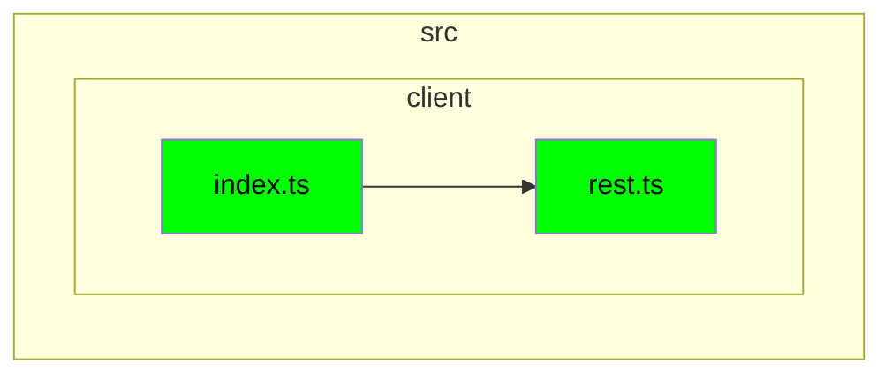

<!-- DMDG BEGIN -->

```mermaid
flowchart LR

subgraph 0["src"]
subgraph 1["client"]
2["index.ts"]
3["rest.ts"]
end
end
2-->3

style 2 fill:lime,color:black
style 3 fill:lime,color:black
```

<!-- DMDG END -->
