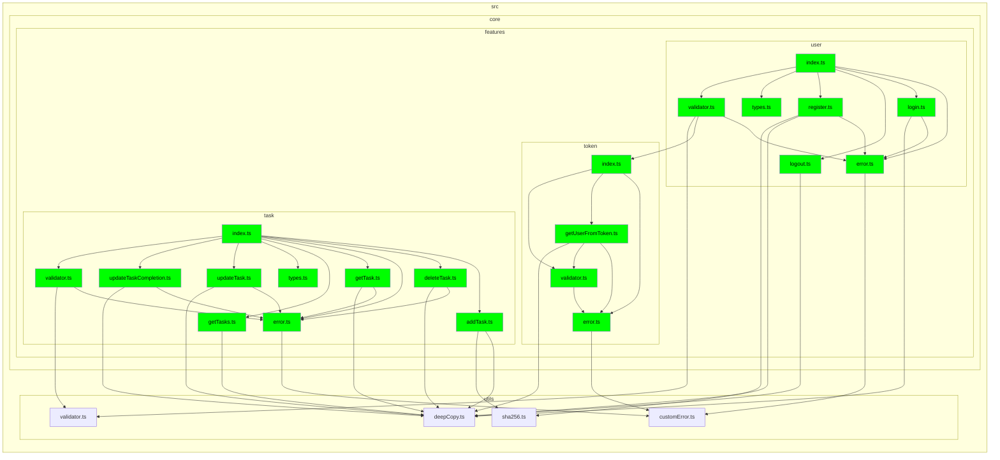

<!-- DMDG BEGIN -->

```mermaid
flowchart LR

subgraph 0["src"]
subgraph 1["core"]
subgraph 2["features"]
subgraph 3["task"]
4["addTask.ts"]
8["deleteTask.ts"]
9["error.ts"]
b["getTask.ts"]
c["getTasks.ts"]
d["index.ts"]
e["types.ts"]
f["updateTask.ts"]
g["updateTaskCompletion.ts"]
h["validator.ts"]
end
subgraph j["token"]
k["error.ts"]
l["getUserFromToken.ts"]
m["validator.ts"]
n["index.ts"]
end
subgraph o["user"]
p["error.ts"]
q["index.ts"]
r["login.ts"]
s["logout.ts"]
t["register.ts"]
u["types.ts"]
v["validator.ts"]
end
end
end
subgraph 5["utils"]
6["deepCopy.ts"]
7["sha256.ts"]
a["customError.ts"]
i["validator.ts"]
end
end
4-->6
4-->7
8-->9
8-->6
9-->a
b-->9
b-->6
c-->6
d-->4
d-->8
d-->9
d-->b
d-->c
d-->e
d-->f
d-->g
d-->h
f-->9
f-->6
g-->9
g-->6
h-->9
h-->i
k-->a
l-->k
l-->m
l-->6
m-->k
n-->k
n-->l
n-->m
p-->a
q-->p
q-->r
q-->s
q-->t
q-->u
q-->v
r-->p
r-->6
s-->6
t-->p
t-->6
t-->7
v-->p
v-->n
v-->i

style 4 fill:lime,color:black
style 8 fill:lime,color:black
style 9 fill:lime,color:black
style b fill:lime,color:black
style c fill:lime,color:black
style d fill:lime,color:black
style e fill:lime,color:black
style f fill:lime,color:black
style g fill:lime,color:black
style h fill:lime,color:black
style k fill:lime,color:black
style l fill:lime,color:black
style m fill:lime,color:black
style n fill:lime,color:black
style p fill:lime,color:black
style q fill:lime,color:black
style r fill:lime,color:black
style s fill:lime,color:black
style t fill:lime,color:black
style u fill:lime,color:black
style v fill:lime,color:black
```

<!-- DMDG END -->
