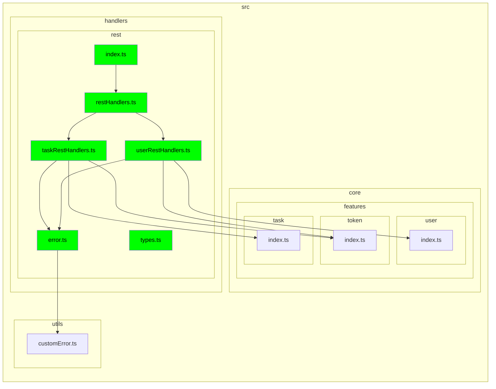

<!-- DMDG BEGIN -->

```mermaid
flowchart LR

subgraph 0["src"]
subgraph 1["handlers"]
subgraph 2["rest"]
3["error.ts"]
6["index.ts"]
7["restHandlers.ts"]
8["taskRestHandlers.ts"]
f["userRestHandlers.ts"]
i["types.ts"]
end
end
subgraph 4["utils"]
5["customError.ts"]
end
subgraph 9["core"]
subgraph a["features"]
subgraph b["task"]
c["index.ts"]
end
subgraph d["token"]
e["index.ts"]
end
subgraph g["user"]
h["index.ts"]
end
end
end
end
3-->5
6-->7
7-->8
7-->f
8-->3
8-->c
8-->e
f-->3
f-->e
f-->h

style 3 fill:lime,color:black
style 6 fill:lime,color:black
style 7 fill:lime,color:black
style 8 fill:lime,color:black
style f fill:lime,color:black
style i fill:lime,color:black
```
<!-- DMDG END -->